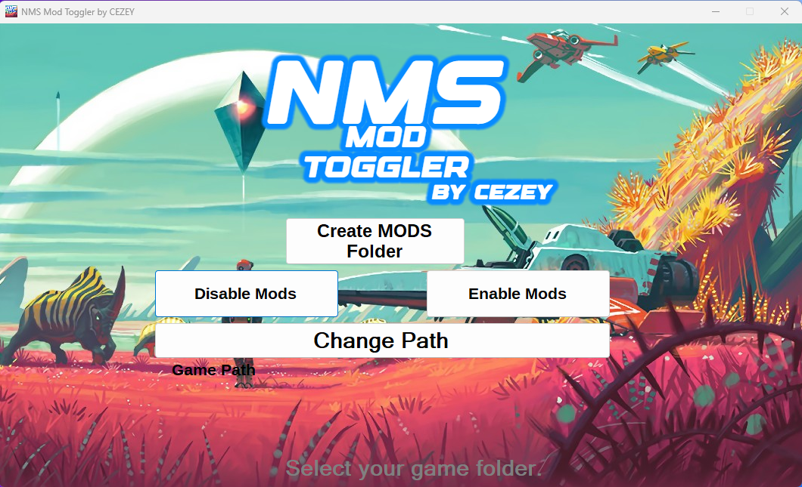

# No Man's Sky Mod Toggler
I made this for people that want to toggle mods on or off really fast by just pressing one click.

(For github users downloading from here, i recommend putting the exe into a folder)

How this functions:
1. You need to choose your NMS path to mods (WHEREYOUHAVETHEGAMEINSTALLED/GAMEDATA)
2. Create MODS Folder (if you don't have it)
3. Disable or enable mods
4. Done!

(Reworked the entire code for better utility)
Now whenever you want to disable mods fast, just open the app and click disable and the app will just rename the MODS folder to _DISABLEDMODS, and same goes for enable mods, it will rename back the MODS folder to it's original state

(FOR DEVS): I used Newtonsoft.json and Costura.Fody packages.
